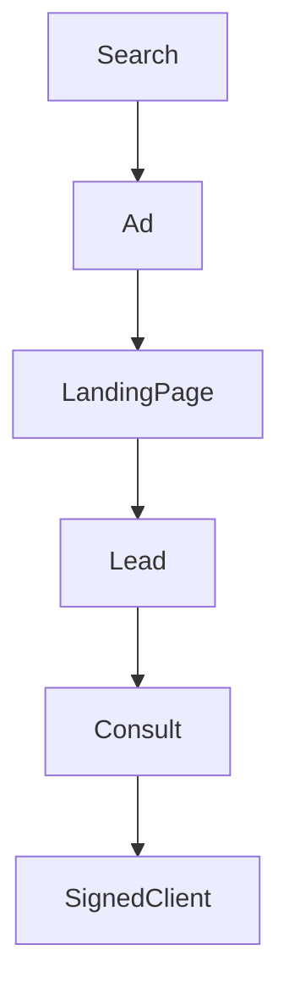

## Lesson

### Written Explanation
Paid search is a system, not just a traffic source. Every click travels through a journey: search → ad → landing page → lead → consult → signed client. If any step fails, performance suffers.

New paid media specialists often focus only on Google Ads metrics like clicks or conversions. However, the real goal is signed clients. That means success depends on both ad platform performance and CRM outcomes.

Understanding the entire system helps you diagnose problems faster. If leads drop, it could be ads. If consults drop, it could be landing pages. If signed clients drop, the issue may be intake quality.

Your role is to protect the full system and ensure each step is aligned.

### Visual (Mermaid)

Audio/Video
type: video
filename: "module-1-walkthrough.mp4"
script: |
  Every click follows a journey from search to signed client.
  Your job is to protect the entire system, not just the ads.
  When performance drops, the system map helps you diagnose where the breakdown occurred.

Practice Exercises

MCQ
id: p1
prompt: "What is the ultimate success metric for paid search?"
options:
  - id: a
    label: "Clicks"
  - id: b
    label: "Signed clients"
correct: [b]

MCQ
id: p2
prompt: "Which system validates real business outcomes?"
options:
  - id: a
    label: "CRM"
  - id: b
    label: "Google Analytics only"
correct: [a]

Short Text
id: p3
prompt: "The paid search journey starts with a user ______."
acceptable_keywords: ["search"]

Drag & Drop
id: p4
prompt: "Match each step to the correct order."
buckets:
  - id: b1
    label: "Earlier Step"
  - id: b2
    label: "Later Step"
items:
  - id: i1
    label: "Ad Click"
  - id: i2
    label: "Signed Client"
correct_buckets:
  i1: b1
  i2: b2

Module Test

MCQ
id: t1
prompt: "Paid search success should ultimately be measured by:"
options:
  - id: a
    label: "Signed clients"
  - id: b
    label: "Impressions"
correct: [a]

Short Text
id: t2
prompt: "Which system tracks signed clients?"
acceptable_keywords: ["crm"]

Drag & Drop
id: t3
prompt: "Match the system to what it measures."
buckets:
  - id: b1
    label: "Google Ads"
  - id: b2
    label: "CRM"
items:
  - id: i1
    label: "Leads"
  - id: i2
    label: "Signed Clients"
correct_buckets:
  i1: b1
  i2: b2
