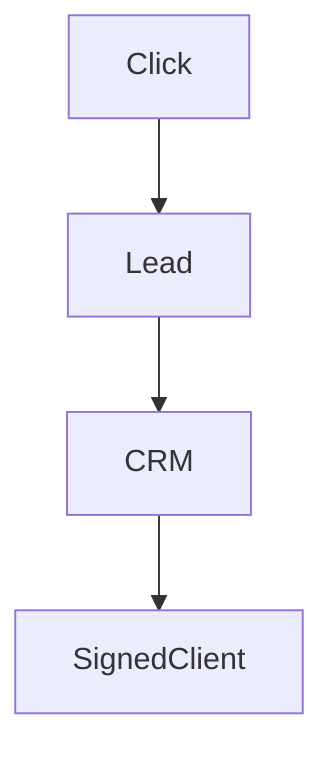

## Lesson

### Written Explanation
Google Ads tracks leads, not revenue. This is one of the most important realities in paid media.

A campaign may generate many leads but few signed clients. Without CRM integration, you may scale campaigns that look successful but are not profitable.

CRM data connects marketing performance to real business results. This allows smarter optimization and prevents scaling poor-quality traffic.

Paid media decisions must be based on signed client outcomes whenever possible.

### Visual (Mermaid)

Audio/Video
type: video
filename: "module-2-walkthrough.mp4"
script: |
  Google Ads tracks leads, but businesses track signed clients.
  CRM integration bridges this gap so we optimize toward real outcomes.
  If you only optimize for leads, you can scale the wrong traffic.

Practice Exercises

MCQ
id: p1
prompt: "Google Ads directly tracks:"
options:
  - id: a
    label: "Signed clients"
  - id: b
    label: "Leads"
correct: [b]

MCQ
id: p2
prompt: "Which system connects marketing to revenue outcomes?"
options:
  - id: a
    label: "CRM"
  - id: b
    label: "Weather app"
correct: [a]

Short Text
id: p3
prompt: "CRM tracks signed ______."
acceptable_keywords: ["clients","cases"]

Drag & Drop
id: p4
prompt: "Match the metric to the system."
buckets:
  - id: b1
    label: "Google Ads"
  - id: b2
    label: "CRM"
items:
  - id: i1
    label: "Leads"
  - id: i2
    label: "Signed Clients"
correct_buckets:
  i1: b1
  i2: b2

Module Test

MCQ
id: t1
prompt: "True optimization requires:"
options:
  - id: a
    label: "CRM data"
  - id: b
    label: "CTR only"
correct: [a]

Short Text
id: t2
prompt: "Leads and ______ are not the same metric."
acceptable_keywords: ["clients","cases","signed clients","signed cases"]

Drag & Drop
id: t3
prompt: "Sort by stage in the funnel."
buckets:
  - id: b1
    label: "Earlier (Platform)"
  - id: b2
    label: "Later (Business Outcome)"
items:
  - id: i1
    label: "Lead"
  - id: i2
    label: "Signed Client"
correct_buckets:
  i1: b1
  i2: b2
