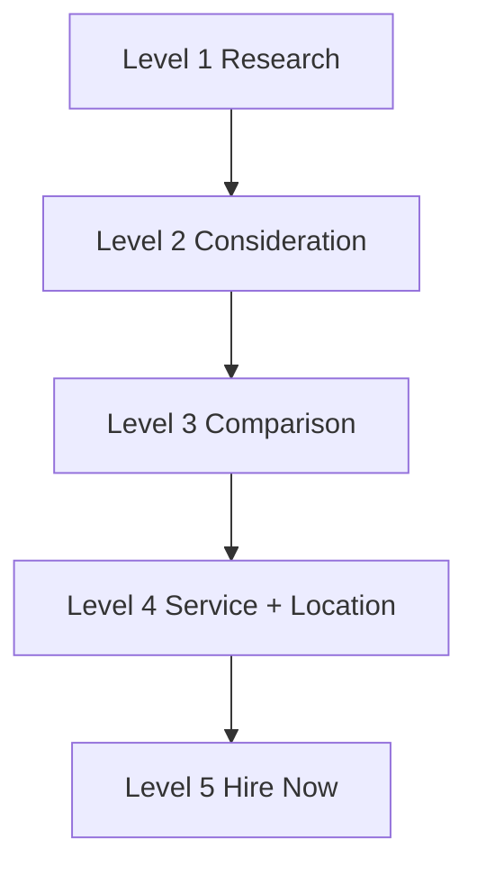

## Lesson

### Written Explanation
Search intent tells you how ready someone is to hire a lawyer. Not all searches are equal in value, even if they include the same topic (like divorce or custody).

Level 5 intent signals immediate hiring intent (for example: “lawyer near me”). Level 1 is early research (for example: “what is mediation”). Paid media prioritizes higher intent to protect budget and lead quality.

When you understand intent, you can make beginner-safe decisions: which keywords to launch first, which campaigns get stable budgets, and which searches should be filtered out with negatives.

### Visual (Mermaid)

Audio/Video
type: video
filename: "module-3-walkthrough.mp4"
script: |
  Intent shows how ready the searcher is to hire.
  Level 5 is “hire now.” Level 1 is “I’m researching.”
  Fund higher intent first, then expand only after performance is stable.

Practice Exercises

MCQ
id: p1
prompt: "Which intent level is highest value for paid search?"
options:
  - id: a
    label: "Level 5"
  - id: b
    label: "Level 1"
correct: [a]

MCQ
id: p2
prompt: "Lower-intent searches should usually receive:"
options:
  - id: a
    label: "Lower priority budget"
  - id: b
    label: "Highest priority budget"
correct: [a]

Short Text
id: p3
prompt: "Higher intent generally means higher ______."
acceptable_keywords: ["value","quality"]

Drag & Drop
id: p4
prompt: "Sort keywords by intent level."
buckets:
  - id: b1
    label: "High Intent"
  - id: b2
    label: "Low Intent"
items:
  - id: i1
    label: "divorce lawyer near me"
  - id: i2
    label: "how does divorce work"
correct_buckets:
  i1: b1
  i2: b2

Module Test

MCQ
id: t1
prompt: "Paid search should prioritize:"
options:
  - id: a
    label: "High-intent searches first"
  - id: b
    label: "Low-intent searches first"
correct: [a]

Short Text
id: t2
prompt: "What is the highest intent level number?"
acceptable_keywords: ["5","level 5"]

Drag & Drop
id: t3
prompt: "Match the search to intent type."
buckets:
  - id: b1
    label: "Hire Intent"
  - id: b2
    label: "Research Intent"
items:
  - id: i1
    label: "attorney near me"
  - id: i2
    label: "what is mediation"
correct_buckets:
  i1: b1
  i2: b2
