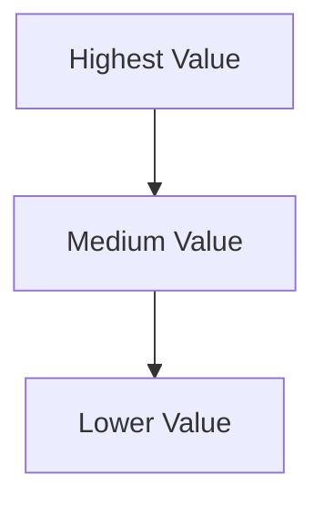

## Lesson

### Written Explanation
Not all family law case types generate the same revenue or lifetime value. Case value tiering is the system that prevents overspending on lower-value services while high-value services starve for budget.

Tier 1 services are the highest value and should receive priority budget first. Tier 2 services can be added once Tier 1 is stable. Tier 3 services are expanded carefully and only when the account can support it.

Tiering keeps scaling predictable. When budgets increase, you know exactly where to invest first.

### Visual (Mermaid)

Audio/Video
type: video
filename: "module-4-walkthrough.mp4"
script: |
  Case types are not equal in business value.
  Tier 1 services get priority budget first.
  Expand to Tier 2 and Tier 3 only after Tier 1 performance is stable.

Practice Exercises

MCQ
id: p1
prompt: "Tier 1 services are typically:"
options:
  - id: a
    label: "Highest value"
  - id: b
    label: "Lowest value"
correct: [a]

MCQ
id: p2
prompt: "Budget should primarily follow:"
options:
  - id: a
    label: "Case value"
  - id: b
    label: "Random selection"
correct: [a]

Short Text
id: p3
prompt: "Tiering protects long-term ______."
acceptable_keywords: ["profitability","profit","roi"]

Drag & Drop
id: p4
prompt: "Sort items by value tier."
buckets:
  - id: b1
    label: "Higher Value"
  - id: b2
    label: "Lower Value"
items:
  - id: i1
    label: "High-asset divorce"
  - id: i2
    label: "Informational / low-value case type"
correct_buckets:
  i1: b1
  i2: b2

Module Test

MCQ
id: t1
prompt: "Tiering helps protect:"
options:
  - id: a
    label: "Profitability"
  - id: b
    label: "Office décor"
correct: [a]

Short Text
id: t2
prompt: "Tier 1 receives priority ______."
acceptable_keywords: ["budget","spend","funding"]

Drag & Drop
id: t3
prompt: "Match tier to priority."
buckets:
  - id: b1
    label: "Priority Budget"
  - id: b2
    label: "Lower Priority"
items:
  - id: i1
    label: "Tier 1"
  - id: i2
    label: "Tier 3"
correct_buckets:
  i1: b1
  i2: b2
