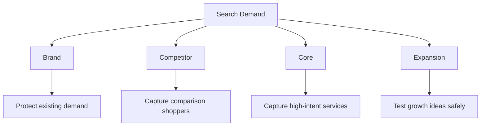

## Lesson

### Written Explanation
Campaign structure is how you control where money goes. If everything lives in one campaign, high‑intent searches compete with low‑intent searches, reporting gets messy, and scaling becomes risky.

The 4‑tier system creates clarity: **Brand, Competitor, Core, Expansion.** Each tier has a different job. Brand protects existing demand. Competitor captures comparison shoppers. Core captures the firm’s highest‑intent service searches. Expansion tests new opportunities without risking core budget.

This structure makes optimization easier. When performance changes, you can identify *which tier* caused it and apply the right fix (budgets, negatives, landing pages, bids) without breaking the rest of the account.

Beginner rule: **Protect Brand, stabilize Core, limit Competitor, and cap Expansion until it proves value in the CRM.**

### Visual (Mermaid)

Audio/Video
type: video
filename: "module-5-walkthrough.mp4"
script: |
  The 4-tier system is your control panel.
  Brand protects existing demand, Core drives the engine, Competitor is limited, and Expansion is capped.
  If you can name the tier and its purpose, you can diagnose problems faster and scale safely.

Practice Exercises

MCQ
id: p1
prompt: "Which tier’s primary job is to protect existing demand for the firm?"
options:
  - id: a
    label: "Brand"
  - id: b
    label: "Core"
  - id: c
    label: "Expansion"
  - id: d
    label: "Competitor"
correct: [a]

MCQ
id: p2
prompt: "Which tier is designed to test new opportunities without risking core performance?"
options:
  - id: a
    label: "Brand"
  - id: b
    label: "Competitor"
  - id: c
    label: "Core"
  - id: d
    label: "Expansion"
correct: [d]

Short Text
id: p3
prompt: "List the four tiers in order (use commas)."
acceptable_keywords: ["brand", "competitor", "core", "expansion"]

Drag & Drop
id: p4
prompt: "Match each tier to its main purpose."
buckets:
  - id: b1
    label: "Protect existing demand"
  - id: b2
    label: "Capture comparison shoppers"
  - id: b3
    label: "Capture high-intent services"
  - id: b4
    label: "Test new opportunities safely"
items:
  - id: i1
    label: "Brand"
  - id: i2
    label: "Competitor"
  - id: i3
    label: "Core"
  - id: i4
    label: "Expansion"
correct_buckets:
  i1: b1
  i2: b2
  i3: b3
  i4: b4

Module Test

MCQ
id: t1
prompt: "Core campaigns primarily target:"
options:
  - id: a
    label: "High-intent service searches (e.g., 'divorce lawyer near me')"
  - id: b
    label: "Display placements"
  - id: c
    label: "Only existing clients"
  - id: d
    label: "Social engagement"
correct: [a]

MCQ
id: t2
prompt: "Why do we separate Expansion from Core?"
options:
  - id: a
    label: "To make the account look bigger"
  - id: b
    label: "To protect core budget and measure tests cleanly"
  - id: c
    label: "Because Google requires it"
  - id: d
    label: "To avoid using negatives"
correct: [b]

MCQ
id: t3
prompt: "Which tier is most likely to be budget-capped until it proves value in CRM?"
options:
  - id: a
    label: "Brand"
  - id: b
    label: "Core"
  - id: c
    label: "Expansion"
  - id: d
    label: "All tiers should be uncapped"
correct: [c]

Short Text
id: t4
prompt: "What system should confirm whether a tier is producing signed clients (not just leads)?"
acceptable_keywords: ["crm"]

Drag & Drop
id: t5
prompt: "Sort the example queries into the correct tier."
buckets:
  - id: b1
    label: "Brand"
  - id: b2
    label: "Competitor"
  - id: b3
    label: "Core"
  - id: b4
    label: "Expansion"
items:
  - id: i1
    label: "Sterling Lawyers divorce attorney"
  - id: i2
    label: "Johnson Law Group vs [Firm Name]"
  - id: i3
    label: "divorce lawyer near me"
  - id: i4
    label: "how does divorce mediation work"
correct_buckets:
  i1: b1
  i2: b2
  i3: b3
  i4: b4

Drag & Drop
id: t6
prompt: "Match the tier to the default budget posture."
buckets:
  - id: b1
    label: "Stable / Priority Budget"
  - id: b2
    label: "Limited / Controlled Budget"
items:
  - id: i1
    label: "Core"
  - id: i2
    label: "Brand"
  - id: i3
    label: "Expansion"
  - id: i4
    label: "Competitor"
correct_buckets:
  i1: b1
  i2: b1
  i3: b2
  i4: b2
