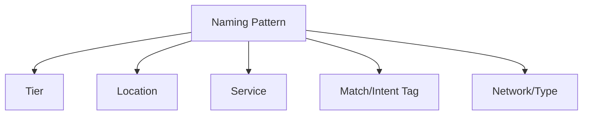

## Lesson

### Written Explanation
Naming is not cosmetic. In an agency environment, naming is how teams prevent mistakes, troubleshoot faster, and onboard new people without tribal knowledge.

A good naming convention answers three questions at a glance: **What is this? Where does it run? What intent/tier is it?** If those answers are unclear, someone will misread performance or make a change in the wrong place.

Beginner-safe rule: build a predictable pattern and never break it. If you need a new idea, create a new field in the pattern (like a tag) instead of inventing random names.

### Visual (Mermaid)

Audio/Video
type: video
filename: "module-6-walkthrough.mp4"
script: |
  Naming conventions reduce errors and speed up reporting.
  A good name tells you tier, location, service, and any important intent or match tags.
  Use one pattern consistently so anyone can read the account without guessing.

Practice Exercises

MCQ
id: p1
prompt: "Why do naming conventions matter most in an agency environment?"
options:
  - id: a
    label: "They make the account look nicer"
  - id: b
    label: "They reduce mistakes and speed up troubleshooting"
correct: [b]

MCQ
id: p2
prompt: "A good campaign name should answer which questions?"
options:
  - id: a
    label: "What it is, where it runs, what tier/intent it represents"
  - id: b
    label: "Only the budget and bid strategy"
correct: [a]

Short Text
id: p3
prompt: "Name one required element you want visible in a campaign name."
acceptable_keywords: ["tier","location","service","intent","match","network"]

Drag & Drop
id: p4
prompt: "Match each label to the meaning it should represent."
buckets:
  - id: b1
    label: "Where it runs"
  - id: b2
    label: "What it sells"
items:
  - id: i1
    label: "Milwaukee"
  - id: i2
    label: "Divorce"
correct_buckets:
  i1: b1
  i2: b2

Module Test

MCQ
id: t1
prompt: "The main purpose of naming conventions is to:"
options:
  - id: a
    label: "Reduce errors and improve clarity"
  - id: b
    label: "Increase impressions"
correct: [a]

MCQ
id: t2
prompt: "Which is the best practice when you need to add more detail to names?"
options:
  - id: a
    label: "Invent a new naming style for that campaign"
  - id: b
    label: "Add a new field/tag to the existing pattern"
correct: [b]

Short Text
id: t3
prompt: "What should a name show at a glance besides the campaign tier?"
acceptable_keywords: ["location","service","intent","match","network","type"]

Drag & Drop
id: t4
prompt: "Sort the labels into the right category."
buckets:
  - id: b1
    label: "Tier/Intent Signals"
  - id: b2
    label: "Geo/Service Signals"
items:
  - id: i1
    label: "Core"
  - id: i2
    label: "Expansion"
  - id: i3
    label: "Orlando"
  - id: i4
    label: "Child Custody"
correct_buckets:
  i1: b1
  i2: b1
  i3: b2
  i4: b2

MCQ
id: t5
prompt: "If a teammate can’t tell what a campaign does from the name, the naming is:"
options:
  - id: a
    label: "Good enough"
  - id: b
    label: "Too ambiguous and should be fixed"
correct: [b]

MCQ
id: t6
prompt: "Naming conventions help most with:"
options:
  - id: a
    label: "Reporting, audits, and handoffs"
  - id: b
    label: "Changing the law in a state"
correct: [a]
