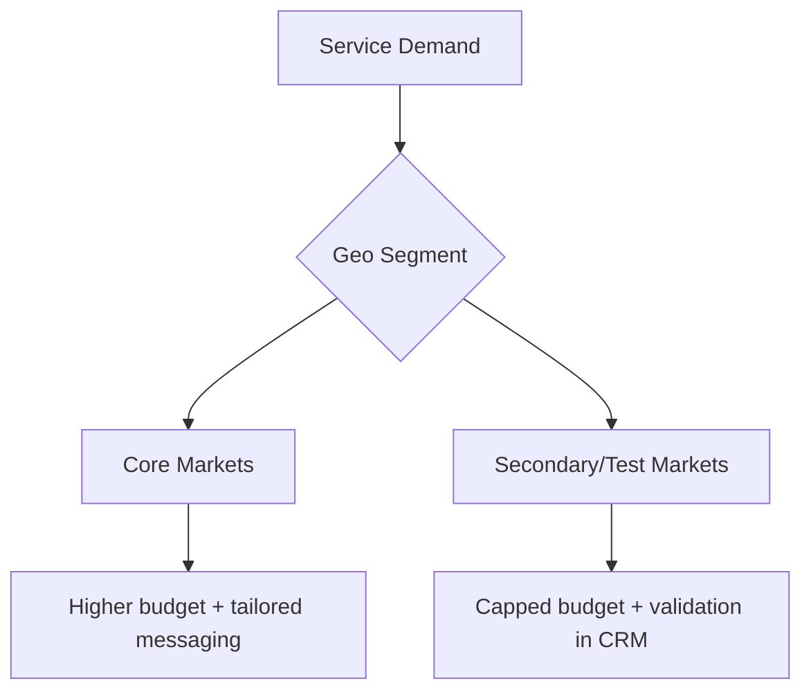

## Lesson

### Written Explanation
Geographic segmentation is how you control relevance and budget. If you mix multiple markets together, high-cost areas can consume budget and hide performance issues in smaller markets.

A beginner-safe approach is to separate **core markets** (highest priority areas) from **secondary markets** (lower priority or test areas). This lets you protect budget where the firm wins cases and cap spend where performance is uncertain.

Geo segmentation also improves messaging. Location-specific ads and landing pages usually convert better because they match what the user searched for.

### Visual (Mermaid)

Audio/Video
type: video
filename: "module-7-walkthrough.mp4"
script: |
  Geo segmentation prevents one market from hiding another.
  Separate core markets from secondary markets so budgets stay intentional.
  Use location-specific messaging and validate outcomes in the CRM.

Practice Exercises

MCQ
id: p1
prompt: "What is the main risk of combining multiple markets into one campaign?"
options:
  - id: a
    label: "It makes reporting clearer"
  - id: b
    label: "A high-cost market can consume budget and hide issues"
correct: [b]

MCQ
id: p2
prompt: "A beginner-safe geo approach is to separate:"
options:
  - id: a
    label: "Core vs secondary/test markets"
  - id: b
    label: "Brand vs Core only"
correct: [a]

Short Text
id: p3
prompt: "Geo segmentation helps protect ______."
acceptable_keywords: ["budget","spend","performance"]

Drag & Drop
id: p4
prompt: "Match the geo segment to the default budget posture."
buckets:
  - id: b1
    label: "Higher Priority"
  - id: b2
    label: "Controlled/Test"
items:
  - id: i1
    label: "Core market"
  - id: i2
    label: "Secondary market"
correct_buckets:
  i1: b1
  i2: b2

Module Test

MCQ
id: t1
prompt: "Geo segmentation improves performance primarily by:"
options:
  - id: a
    label: "Increasing office locations"
  - id: b
    label: "Improving relevance and budget control"
correct: [b]

MCQ
id: t2
prompt: "Which market should generally get priority budget?"
options:
  - id: a
    label: "Core markets"
  - id: b
    label: "Unproven test markets"
correct: [a]

Short Text
id: t3
prompt: "Name the system used to confirm whether a geo segment produces signed clients."
acceptable_keywords: ["crm"]

Drag & Drop
id: t4
prompt: "Sort the actions into the correct bucket."
buckets:
  - id: b1
    label: "Core Market Actions"
  - id: b2
    label: "Secondary/Test Actions"
items:
  - id: i1
    label: "Increase budget after stable performance"
  - id: i2
    label: "Cap budget until outcomes are proven"
  - id: i3
    label: "Use location-specific ads and landing pages"
  - id: i4
    label: "Run limited experiments and monitor closely"
correct_buckets:
  i1: b1
  i3: b1
  i2: b2
  i4: b2

MCQ
id: t5
prompt: "Combining markets makes it harder to:"
options:
  - id: a
    label: "Identify which area is driving results"
  - id: b
    label: "Create a spreadsheet"
correct: [a]

MCQ
id: t6
prompt: "Geo-specific messaging typically:"
options:
  - id: a
    label: "Improves relevance and conversion rate"
  - id: b
    label: "Always lowers click volume"
correct: [a]
