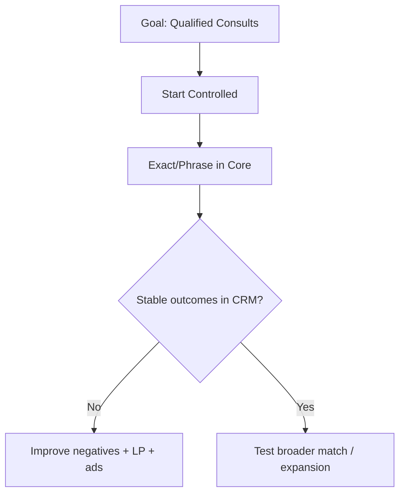

## Lesson

### Written Explanation
Match types are a control lever. The more you loosen match, the more volume you can get—but the more irrelevant traffic you risk. Beginners should bias toward control first and scale second.

Exact and phrase match are best for core, high-intent campaigns because they protect relevance. Broad match can work, but only when conversion quality is proven and negative keyword hygiene is strong.

Campaign types matter too. Search is the primary engine for family law lead gen. Anything outside core search (like experiments) should be constrained and validated carefully.

### Visual (Mermaid)

Audio/Video
type: video
filename: "module-8-walkthrough.mp4"
script: |
  Match types trade control for volume.
  Start with exact and phrase in core campaigns.
  Only loosen match when quality is stable and negatives are strong.
  Scale is earned after outcomes are validated in the CRM.

Practice Exercises

MCQ
id: p1
prompt: "Which match types are most beginner-safe for Core campaigns?"
options:
  - id: a
    label: "Exact and phrase"
  - id: b
    label: "Broad only"
correct: [a]

MCQ
id: p2
prompt: "Broad match should generally be used when:"
options:
  - id: a
    label: "You want fast volume regardless of quality"
  - id: b
    label: "Quality is proven and negative hygiene is strong"
correct: [b]

Short Text
id: p3
prompt: "Match types balance control vs ______."
acceptable_keywords: ["volume","scale"]

Drag & Drop
id: p4
prompt: "Sort match types by control level."
buckets:
  - id: b1
    label: "More Control"
  - id: b2
    label: "Less Control"
items:
  - id: i1
    label: "Exact"
  - id: i2
    label: "Phrase"
  - id: i3
    label: "Broad"
correct_buckets:
  i1: b1
  i2: b1
  i3: b2

Module Test

MCQ
id: t1
prompt: "Why do beginners bias toward exact/phrase in core campaigns?"
options:
  - id: a
    label: "They protect relevance and lead quality"
  - id: b
    label: "They eliminate the need for landing pages"
correct: [a]

MCQ
id: t2
prompt: "Broad match increases which risk most?"
options:
  - id: a
    label: "Irrelevant traffic"
  - id: b
    label: "Faster page load time"
correct: [a]

Short Text
id: t3
prompt: "Name the system used to validate lead quality before loosening match types."
acceptable_keywords: ["crm"]

Drag & Drop
id: t4
prompt: "Match the match type to the typical use."
buckets:
  - id: b1
    label: "Core / High Intent"
  - id: b2
    label: "Expansion / Testing"
items:
  - id: i1
    label: "Exact"
  - id: i2
    label: "Phrase"
  - id: i3
    label: "Broad"
correct_buckets:
  i1: b1
  i2: b1
  i3: b2

MCQ
id: t5
prompt: "Before testing broader match, you should first:"
options:
  - id: a
    label: "Turn off negatives"
  - id: b
    label: "Clean search terms and strengthen negatives"
correct: [b]

MCQ
id: t6
prompt: "In most family law accounts, the primary lead engine is:"
options:
  - id: a
    label: "Search campaigns"
  - id: b
    label: "Display-only campaigns"
correct: [a]
