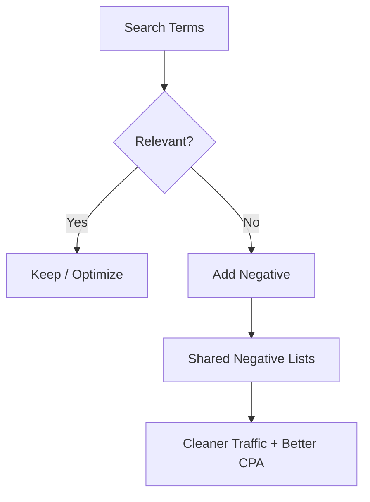

## Lesson

### Written Explanation
Negative keywords are your defense system. They prevent your ads from showing on searches that are irrelevant, low-intent, or outside the firm’s services (like “free,” “DIY,” or unrelated legal areas).

Without negative hygiene, accounts drift. Broad match and even phrase match can pull in unwanted queries, which wastes budget and floods intake with low-quality leads.

Beginner rule: review search terms regularly, add negatives quickly, and use shared negative lists for consistency across campaigns. The goal is simple: **buy the right searches and block the wrong ones.**

### Visual (Mermaid)

Audio/Video
type: video
filename: "module-9-walkthrough.mp4"
script: |
  Negatives protect your budget and your intake team.
  Review search terms, block irrelevant queries, and reuse shared lists.
  Strong negative hygiene is what makes scaling safer—especially with broader match types.

Practice Exercises

MCQ
id: p1
prompt: "The primary purpose of negative keywords is to:"
options:
  - id: a
    label: "Increase irrelevant impressions"
  - id: b
    label: "Block irrelevant searches and protect budget"
correct: [b]

MCQ
id: p2
prompt: "Which process produces the best negative keyword ideas?"
options:
  - id: a
    label: "Guessing"
  - id: b
    label: "Search terms review"
correct: [b]

Short Text
id: p3
prompt: "Negatives help protect budget and lead ______."
acceptable_keywords: ["quality"]

Drag & Drop
id: p4
prompt: "Sort the terms into the right bucket."
buckets:
  - id: b1
    label: "Add as Negative"
  - id: b2
    label: "Keep (Relevant)"
items:
  - id: i1
    label: "free divorce forms"
  - id: i2
    label: "divorce attorney near me"
correct_buckets:
  i1: b1
  i2: b2

Module Test

MCQ
id: t1
prompt: "What happens to an account without negative keyword hygiene?"
options:
  - id: a
    label: "Traffic gets cleaner over time automatically"
  - id: b
    label: "It can drift into irrelevant traffic and waste spend"
correct: [b]

MCQ
id: t2
prompt: "Shared negative lists are used to:"
options:
  - id: a
    label: "Keep negatives consistent across campaigns"
  - id: b
    label: "Replace conversion tracking"
correct: [a]

Short Text
id: t3
prompt: "Name the report used to find bad queries to negate."
acceptable_keywords: ["search terms","search term","search terms report"]

Drag & Drop
id: t4
prompt: "Match the query to the right action."
buckets:
  - id: b1
    label: "Negate"
  - id: b2
    label: "Allow"
items:
  - id: i1
    label: "how to file divorce myself"
  - id: i2
    label: "child custody lawyer orlando"
correct_buckets:
  i1: b1
  i2: b2

MCQ
id: t5
prompt: "Negatives are especially important when using:"
options:
  - id: a
    label: "Broader match types"
  - id: b
    label: "No keywords at all"
correct: [a]

MCQ
id: t6
prompt: "The outcome of strong negative hygiene is usually:"
options:
  - id: a
    label: "Cleaner traffic and better lead quality"
  - id: b
    label: "More irrelevant clicks"
correct: [a]
