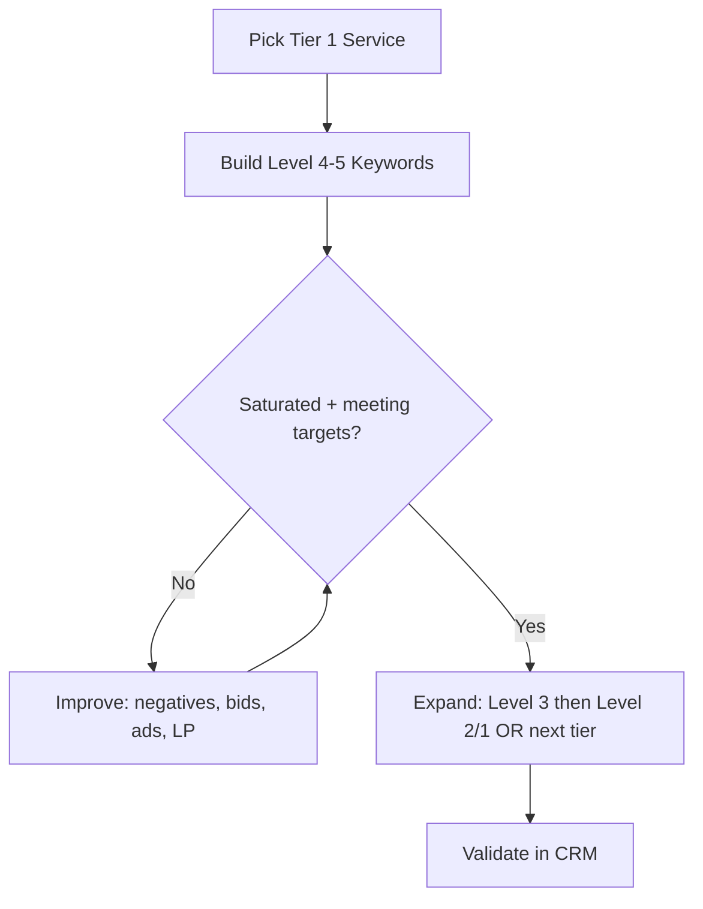

## Lesson

### Written Explanation
Keyword strategy is a control system—not a list-building exercise. Your job is to buy searches that signal “I need a lawyer” before you spend on “I’m researching.” That’s why we prioritize higher-intent queries first.

Start by building coverage for the highest-value case types (Tier 1) and the highest-intent keywords inside those tiers. Only after those campaigns are consistently spending and meeting targets should you expand to lower intent or lower value tiers.

Expansion is a decision, not a default. If you add too many low-intent keywords early, you dilute budget, inflate CPA, and make it harder to read what’s working. The rule is simple: **fund high-intent first, prove saturation, then expand intentionally.**

### Visual (Mermaid)

Audio/Video
type: video
filename: "module-10-walkthrough.mp4"
script: |
  Keywords aren’t equal—intent determines value.
  Start with Tier 1 services and Level 4–5 keywords.
  Expand only after high-intent campaigns are saturated and meeting targets.
  Validate impact with signed-case outcomes in the CRM.

Practice Exercises

MCQ
id: p1
prompt: "Which keyword set should receive budget first in a new family law account?"
options:
  - id: a
    label: "Level 1–2 informational keywords across many services"
  - id: b
    label: "Level 4–5 hire-intent keywords in Tier 1 services"
  - id: c
    label: "Broad match keywords for every practice area"
  - id: d
    label: "Competitor keywords only"
correct: [b]

MCQ
id: p2
prompt: "When is it appropriate to expand into lower-intent keywords (Level 1–3)?"
options:
  - id: a
    label: "Immediately, to increase volume"
  - id: b
    label: "Only after high-intent campaigns are saturated and meeting targets"
  - id: c
    label: "Only when CTR is low"
  - id: d
    label: "Only after adding broad match"
correct: [b]

Short Text
id: p3
prompt: "Complete the rule: Fund high intent first, prove ________, then expand intentionally."
acceptable_keywords: ["saturation","saturated"]

Drag & Drop
id: p4
prompt: "Sort the keywords into the right intent bucket."
buckets:
  - id: b1
    label: "High Intent (Fund First)"
  - id: b2
    label: "Low Intent (Fund Later)"
items:
  - id: i1
    label: "divorce lawyer near me"
  - id: i2
    label: "child custody attorney chicago"
  - id: i3
    label: "how does divorce work"
  - id: i4
    label: "what is alimony"
correct_buckets:
  i1: b1
  i2: b1
  i3: b2
  i4: b2

Module Test

MCQ
id: t1
prompt: "Why can expanding too early into low-intent keywords be harmful?"
options:
  - id: a
    label: "It increases Quality Score automatically"
  - id: b
    label: "It dilutes budget and can inflate CPA"
  - id: c
    label: "It prevents conversion tracking"
  - id: d
    label: "It forces exact match only"
correct: [b]

MCQ
id: t2
prompt: "What is the correct first step in keyword strategy for a new account?"
options:
  - id: a
    label: "Add every relevant keyword to one campaign"
  - id: b
    label: "Build Level 4–5 coverage for Tier 1 services"
  - id: c
    label: "Start with display remarketing"
  - id: d
    label: "Start with Level 1 content keywords"
correct: [b]

MCQ
id: t3
prompt: "Which is an example of a Level 5 intent keyword?"
options:
  - id: a
    label: "what is divorce mediation"
  - id: b
    label: "divorce attorney near me"
  - id: c
    label: "divorce statistics"
  - id: d
    label: "how long does divorce take"
correct: [b]

Short Text
id: t4
prompt: "What data source should be used to confirm whether keyword expansion is improving signed-case outcomes?"
acceptable_keywords: ["crm"]

Drag & Drop
id: t5
prompt: "Match the action to the correct phase."
buckets:
  - id: b1
    label: "Before Expansion"
  - id: b2
    label: "After Expansion"
items:
  - id: i1
    label: "Confirm high-intent campaigns are consistently spending"
  - id: i2
    label: "Evaluate signed cases by keyword theme in CRM"
  - id: i3
    label: "Add Level 3 keywords with controlled budgets"
  - id: i4
    label: "Clean search terms with negatives"
correct_buckets:
  i1: b1
  i4: b1
  i3: b2
  i2: b2

MCQ
id: t6
prompt: "The best definition of 'saturation' is:"
options:
  - id: a
    label: "The campaign spent one day at full budget"
  - id: b
    label: "The campaign is constrained by budget and could spend more on relevant traffic"
  - id: c
    label: "CTR is above 10%"
  - id: d
    label: "You added broad match"
correct: [b]
