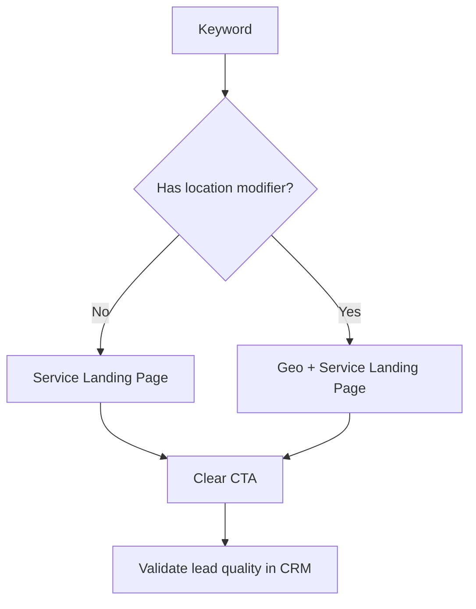

## Lesson

### Written Explanation
Landing page assignment is one of the highest-leverage decisions in a search account. In family law, the closer the landing page matches the searcher’s intent—especially location and service—the higher the conversion rate and the better the lead quality.

Use a relevance hierarchy. If the search includes a city/area, send it to a geo-specific page for that service. If it’s service-only, send to the best service page. Avoid sending paid traffic to broad informational resources unless you have a deliberate test and a clear conversion path.

Mismatch creates friction: the user searched for a specific service in a specific place, but the page feels generic. The rule: **the ad and landing page should answer the same question the keyword asked.**

### Visual (Mermaid)

Audio/Video
type: video
filename: "module-11-walkthrough.mp4"
script: |
  Landing page relevance drives conversion rate and lead quality.
  If the keyword includes a location, send it to a geo + service page.
  If it’s service-only, send it to the best service page.
  Validate lead quality in the CRM.

Practice Exercises

MCQ
id: p1
prompt: "A user searches 'child custody lawyer Milwaukee'. Where should you send them?"
options:
  - id: a
    label: "Homepage"
  - id: b
    label: "Milwaukee child custody landing page (geo + service)"
  - id: c
    label: "A blog article about custody"
  - id: d
    label: "Careers page"
correct: [b]

MCQ
id: p2
prompt: "What is the biggest risk of sending all paid traffic to one generic page?"
options:
  - id: a
    label: "Higher relevance and lower CPA"
  - id: b
    label: "Lower relevance, lower conversion rate, and higher CPA"
  - id: c
    label: "More exact match impressions"
  - id: d
    label: "Improved CRM reporting"
correct: [b]

Short Text
id: p3
prompt: "Fill in the rule: The keyword, ad, and landing page should answer the same ________."
acceptable_keywords: ["question","intent"]

Drag & Drop
id: p4
prompt: "Match each keyword to the best landing page type."
buckets:
  - id: b1
    label: "Geo + Service Page"
  - id: b2
    label: "Service Page"
items:
  - id: i1
    label: "divorce lawyer tampa"
  - id: i2
    label: "paternity attorney"
  - id: i3
    label: "alimony attorney"
  - id: i4
    label: "child support attorney orlando"
correct_buckets:
  i1: b1
  i4: b1
  i2: b2
  i3: b2

Module Test

MCQ
id: t1
prompt: "Landing page assignment primarily impacts which outcomes?"
options:
  - id: a
    label: "Conversion rate and lead quality"
  - id: b
    label: "Weather"
  - id: c
    label: "Office rent"
  - id: d
    label: "Logo design"
correct: [a]

MCQ
id: t2
prompt: "What is the best page choice for a service-only keyword like 'divorce attorney'?"
options:
  - id: a
    label: "City-specific page for a random city"
  - id: b
    label: "Service page for divorce"
  - id: c
    label: "Blog post about divorce"
  - id: d
    label: "Homepage"
correct: [b]

MCQ
id: t3
prompt: "Which pairing is most aligned with the relevance hierarchy?"
options:
  - id: a
    label: "'custody lawyer chicago' → Chicago custody page"
  - id: b
    label: "'custody lawyer chicago' → generic homepage"
  - id: c
    label: "'custody lawyer chicago' → careers page"
  - id: d
    label: "'custody lawyer chicago' → unrelated practice area page"
correct: [a]

Short Text
id: t4
prompt: "Name the system used to validate lead quality beyond Google Ads conversions."
acceptable_keywords: ["crm"]

Drag & Drop
id: t5
prompt: "Sort the pages by expected performance for geo-modified keywords."
buckets:
  - id: b1
    label: "Higher Expected Performance"
  - id: b2
    label: "Lower Expected Performance"
items:
  - id: i1
    label: "Geo + service landing page"
  - id: i2
    label: "Service page without location"
  - id: i3
    label: "Generic homepage"
correct_buckets:
  i1: b1
  i2: b1
  i3: b2

MCQ
id: t6
prompt: "A mismatch between keyword and landing page usually causes:"
options:
  - id: a
    label: "Higher relevance and higher conversion rate"
  - id: b
    label: "Friction and lower conversion rate"
  - id: c
    label: "Automatic tracking fixes"
  - id: d
    label: "No impact"
correct: [b]
