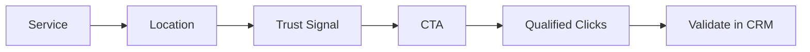

## Lesson

### Written Explanation
Family law ads must do two jobs quickly: prove relevance and reduce uncertainty. The fastest way is a consistent structure: **Service + Location + Trust Signal + CTA**. This keeps ads aligned to what the searcher typed.

Start with the service, reinforce the location, add one trust signal (clear process, responsiveness, experience), and finish with a clear CTA like “Schedule a Consultation” or “Call Today.” Avoid unverifiable claims like “#1” or “guaranteed results.”

Good ad copy protects lead quality. The goal is not maximum clicks—it’s **qualified clicks that turn into consults and signed cases** and can be validated in the CRM.

### Visual (Mermaid)

Audio/Video
type: video
filename: "module-12-walkthrough.mp4"
script: |
  Family law ads must prove relevance and reduce uncertainty fast.
  Use the structure: Service, Location, Trust Signal, CTA.
  Don’t chase clicks—chase qualified clicks that become consults and signed cases.
  Validate quality with CRM outcomes.

Practice Exercises

MCQ
id: p1
prompt: "Which ad element should usually appear first for high-intent search ads?"
options:
  - id: a
    label: "CTA"
  - id: b
    label: "Service"
  - id: c
    label: "Sitelinks"
  - id: d
    label: "Disclaimer"
correct: [b]

MCQ
id: p2
prompt: "Why is overly generic ad copy risky?"
options:
  - id: a
    label: "It increases qualified clicks"
  - id: b
    label: "It can lower relevance and attract the wrong clicks"
  - id: c
    label: "It improves CRM reporting"
  - id: d
    label: "It forces exact match"
correct: [b]

Short Text
id: p3
prompt: "List the four-part ad structure in order (use commas)."
acceptable_keywords: ["service","location","trust","cta","trust signal"]

Drag & Drop
id: p4
prompt: "Match each line to the ad element it represents."
buckets:
  - id: b1
    label: "Service"
  - id: b2
    label: "Location"
  - id: b3
    label: "Trust Signal"
  - id: b4
    label: "CTA"
items:
  - id: i1
    label: "Divorce Attorney"
  - id: i2
    label: "Serving Tampa & Hillsborough County"
  - id: i3
    label: "Clear guidance through filing and mediation"
  - id: i4
    label: "Schedule a Consultation"
correct_buckets:
  i1: b1
  i2: b2
  i3: b3
  i4: b4

Module Test

MCQ
id: t1
prompt: "The primary goal of ad copy in family law search is to drive:"
options:
  - id: a
    label: "Maximum clicks at any cost"
  - id: b
    label: "Qualified clicks that become consults and signed cases"
  - id: c
    label: "More impressions than competitors"
  - id: d
    label: "Only brand searches"
correct: [b]

MCQ
id: t2
prompt: "Which trust signal is most appropriate for beginner-safe ad copy?"
options:
  - id: a
    label: "We are the #1 best lawyer in the state"
  - id: b
    label: "Clear guidance through the process"
  - id: c
    label: "Guaranteed win"
  - id: d
    label: "Cheapest lawyer"
correct: [b]

MCQ
id: t3
prompt: "Where should 'Location' typically appear in the ad structure?"
options:
  - id: a
    label: "Before service"
  - id: b
    label: "After service and before trust signal"
  - id: c
    label: "Only in the final URL"
  - id: d
    label: "Never"
correct: [b]

Short Text
id: t4
prompt: "Name the system used to validate whether ad clicks are turning into signed cases."
acceptable_keywords: ["crm"]

Drag & Drop
id: t5
prompt: "Sort the ad lines into the correct order."
buckets:
  - id: b1
    label: "1"
  - id: b2
    label: "2"
  - id: b3
    label: "3"
  - id: b4
    label: "4"
items:
  - id: i1
    label: "Schedule a Consultation"
  - id: i2
    label: "Divorce Attorney"
  - id: i3
    label: "Serving Orlando"
  - id: i4
    label: "Clear, step-by-step legal guidance"
correct_buckets:
  i2: b1
  i3: b2
  i4: b3
  i1: b4

MCQ
id: t6
prompt: "Which CTA is most appropriate for a high-intent search ad?"
options:
  - id: a
    label: "Read our blog"
  - id: b
    label: "Schedule a Consultation"
  - id: c
    label: "Follow us on social media"
  - id: d
    label: "Watch a documentary"
correct: [b]
