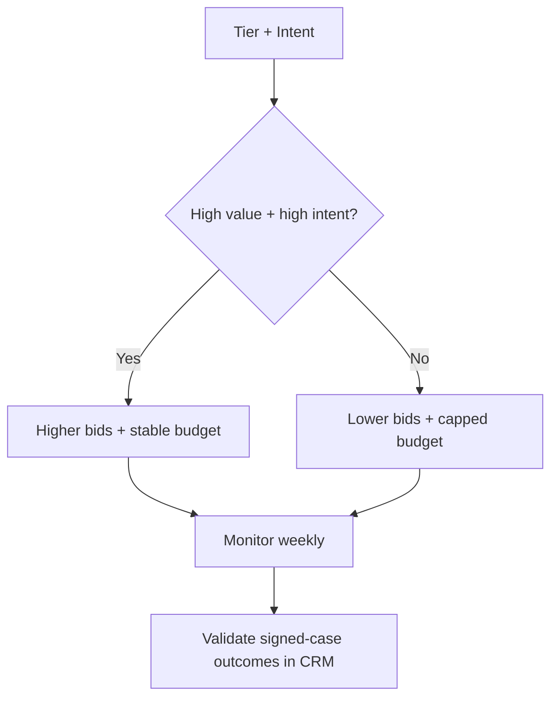

## Lesson

### Written Explanation
Bids and budgets should follow two drivers: **intent level** and **case value tier**. High-intent, high-value traffic is worth more, so those campaigns get stable budgets and competitive bids.

Lower-intent and experimental campaigns should be constrained. If you overfund them, they can spend quickly without producing qualified consults. That’s how accounts drift from profitable to noisy.

A beginner-safe approach is to start controlled, monitor weekly, and scale only when signed-case outcomes improve. Always validate impact in the CRM.

### Visual (Mermaid)

Audio/Video
type: video
filename: "module-13-walkthrough.mp4"
script: |
  Bids and budgets follow intent and case value.
  High-intent Tier 1 campaigns get stable budgets and competitive bids.
  Lower-intent and experimental campaigns stay capped until proven.
  Scale based on signed-case outcomes validated in the CRM.

Practice Exercises

MCQ
id: p1
prompt: "Which campaigns should typically receive the most stable budget allocation?"
options:
  - id: a
    label: "High-intent, Tier 1 service campaigns"
  - id: b
    label: "Low-intent informational campaigns"
  - id: c
    label: "Experimental broad match campaigns"
  - id: d
    label: "Paused campaigns"
correct: [a]

MCQ
id: p2
prompt: "Why should low-intent campaigns usually be capped?"
options:
  - id: a
    label: "They always outperform high-intent campaigns"
  - id: b
    label: "They can spend without producing qualified consults"
  - id: c
    label: "They increase CRM integrations"
  - id: d
    label: "They reduce the need for negatives"
correct: [b]

Short Text
id: p3
prompt: "Fill in the rule: Increase budget where ________ outcomes are improving."
acceptable_keywords: ["signed","signed-case","cases","crm"]

Drag & Drop
id: p4
prompt: "Match the campaign type to the default budget posture."
buckets:
  - id: b1
    label: "Stable / Priority Budget"
  - id: b2
    label: "Capped / Controlled Budget"
items:
  - id: i1
    label: "Tier 1 + Level 5 intent"
  - id: i2
    label: "Level 2 informational expansion"
  - id: i3
    label: "Competitor tests (limited)"
  - id: i4
    label: "Core high-intent service keywords"
correct_buckets:
  i1: b1
  i4: b1
  i2: b2
  i3: b2

Module Test

MCQ
id: t1
prompt: "Budget allocation should primarily follow:"
options:
  - id: a
    label: "Intent and case value tier"
  - id: b
    label: "Time of day only"
  - id: c
    label: "Logo colors"
  - id: d
    label: "Number of sitelinks"
correct: [a]

MCQ
id: t2
prompt: "What is the main risk of overfunding experimental campaigns?"
options:
  - id: a
    label: "They will stop spending"
  - id: b
    label: "They can consume budget without producing qualified results"
  - id: c
    label: "They increase call tracking accuracy"
  - id: d
    label: "They improve landing page relevance"
correct: [b]

MCQ
id: t3
prompt: "Which action is best after increasing budget on a high-intent campaign?"
options:
  - id: a
    label: "Ignore CRM and focus on impressions"
  - id: b
    label: "Validate changes using signed-case outcomes in CRM"
  - id: c
    label: "Turn off negatives"
  - id: d
    label: "Switch everything to broad match"
correct: [b]

Short Text
id: t4
prompt: "Name the system used to validate whether increased spend leads to signed clients."
acceptable_keywords: ["crm"]

Drag & Drop
id: t5
prompt: "Sort actions into the correct bucket."
buckets:
  - id: b1
    label: "Scale"
  - id: b2
    label: "Constrain"
items:
  - id: i1
    label: "Increase budget for Tier 1 + Level 5 campaigns with strong CRM outcomes"
  - id: i2
    label: "Cap experimental broad match campaign until lead quality is proven"
  - id: i3
    label: "Raise bids on high-intent terms that are losing auctions"
  - id: i4
    label: "Reduce budget on low-intent campaigns producing weak consult quality"
correct_buckets:
  i1: b1
  i3: b1
  i2: b2
  i4: b2

MCQ
id: t6
prompt: "Scaling should be based primarily on:"
options:
  - id: a
    label: "Clicks and impressions"
  - id: b
    label: "Signed-case outcomes in CRM"
correct: [b]
