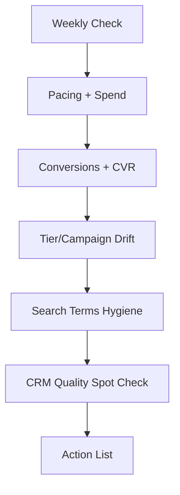

## Lesson

### Written Explanation
Weekly monitoring is how you prevent surprises. Instead of waiting for a monthly report to reveal a problem, you check the account in a predictable order so you can spot drift early—before budget is wasted and before lead quality drops.

A beginner-safe weekly workflow focuses on a small set of signals: spend pacing, conversion volume, conversion rate, key campaign/tier performance, and search term health. You are not trying to “optimize everything” each week—you are trying to identify what changed and whether it needs action.

The most common weekly failures are simple: budgets shifted to the wrong tier, irrelevant queries started spending, tracking broke, or a landing page slowed down. A consistent check order helps you catch these quickly.

Your weekly outcome should be a short list of actions: add negatives, adjust budgets between tiers, fix obvious tracking issues, and flag anything that needs deeper diagnosis.

### Visual (Mermaid)

Audio/Video
type: video
filename: "module-14-weekly-monitoring-workflow.mp4"
script: |
  Weekly monitoring prevents surprises.
  Check pacing, conversions, tier drift, and search term hygiene in a consistent order.
  Then do a quick CRM quality spot check and leave the week with a short action list.

Practice Exercises

MCQ
id: p1
prompt: "The main purpose of weekly monitoring is to:"
options:
  - id: a
    label: "Optimize every setting each week"
  - id: b
    label: "Catch issues early and prevent performance drift"
correct: [b]

MCQ
id: p2
prompt: "A beginner-safe weekly workflow should focus on:"
options:
  - id: a
    label: "A small set of repeatable signals (pacing, conversions, drift, search terms)"
  - id: b
    label: "Rebuilding the entire account structure"
correct: [a]

Short Text
id: p3
prompt: "Weekly monitoring helps prevent performance ______."
acceptable_keywords: ["drift","drops","declines"]

Drag & Drop
id: p4
prompt: "Match the weekly check item to what it protects."
buckets:
  - id: b1
    label: "Budget Control"
  - id: b2
    label: "Lead Quality"
items:
  - id: i1
    label: "Pacing + spend by tier"
  - id: i2
    label: "Search terms hygiene (negatives)"
correct_buckets:
  i1: b1
  i2: b2

Module Test

MCQ
id: t1
prompt: "Which order is most beginner-safe for weekly checks?"
options:
  - id: a
    label: "Pacing → conversions/CVR → tier drift → search terms → CRM spot check"
  - id: b
    label: "Rewrite ads → change bids → check pacing"
correct: [a]

MCQ
id: t2
prompt: "If conversions suddenly drop across the account, the first weekly check should be:"
options:
  - id: a
    label: "Verify tracking and recent changes"
  - id: b
    label: "Launch broad match everywhere"
correct: [a]

Short Text
id: t3
prompt: "Name the system used to validate lead quality beyond platform conversions."
acceptable_keywords: ["crm"]

Drag & Drop
id: t4
prompt: "Sort the items into the correct bucket."
buckets:
  - id: b1
    label: "Weekly Must-Check"
  - id: b2
    label: "Not Required Weekly"
items:
  - id: i1
    label: "Search terms report review"
  - id: i2
    label: "Budget pacing by tier"
  - id: i3
    label: "Full landing page redesign"
  - id: i4
    label: "Conversion rate trend"
correct_buckets:
  i1: b1
  i2: b1
  i4: b1
  i3: b2

MCQ
id: t5
prompt: "Search term hygiene primarily protects against:"
options:
  - id: a
    label: "Irrelevant queries wasting spend"
  - id: b
    label: "Too many sitelinks"
correct: [a]

MCQ
id: t6
prompt: "The best weekly output is:"
options:
  - id: a
    label: "A short action list tied to what changed"
  - id: b
    label: "A 20-page report with every metric"
correct: [a]
