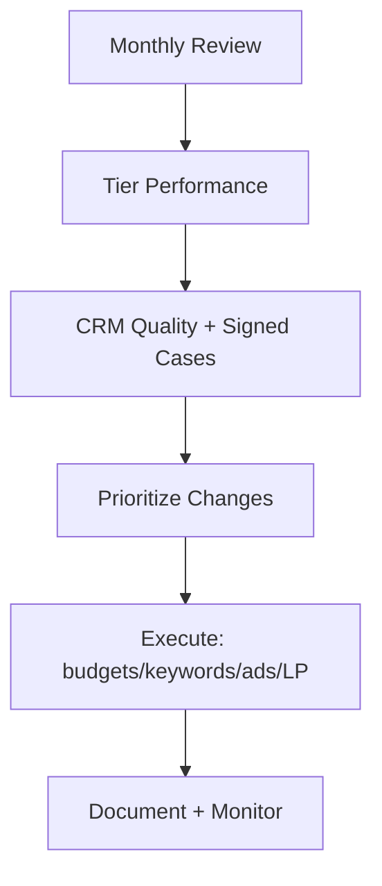

## Lesson

### Written Explanation
Monthly optimization is where you make bigger, deliberate changes—after you’ve monitored stability weekly. The goal is controlled improvement, not constant tinkering.

A safe monthly workflow reviews performance by tier, validates lead quality in CRM, and then prioritizes changes: budget reallocation, keyword expansion or contraction, ad testing, and landing page improvements. You should always start with the highest leverage: fix tracking issues, protect high-intent tiers, and remove waste.

Beginners often optimize based on platform metrics alone. Monthly work should connect metrics to outcomes: consult rate, signed cases, and case quality. If a campaign generates leads but not signed clients, it needs constraints or a strategy change.

End the month with documentation: what changed, why it changed, and what you expect to happen. This makes future diagnosis faster.

### Visual (Mermaid)

Audio/Video
type: video
filename: "module-15-monthly-optimization-workflow.mp4"
script: |
  Monthly optimization is controlled improvement.
  Review tier performance, validate quality in the CRM, then prioritize high-leverage changes.
  Execute budgets, keywords, ads, and landing page updates—then document what you changed and why.

Practice Exercises

MCQ
id: p1
prompt: "Monthly optimization should focus on:"
options:
  - id: a
    label: "Bigger, deliberate improvements based on trends"
  - id: b
    label: "Daily micro-changes to every setting"
correct: [a]

MCQ
id: p2
prompt: "The biggest risk of optimizing only on Google Ads metrics is:"
options:
  - id: a
    label: "You might scale campaigns that don’t produce signed clients"
  - id: b
    label: "You might get too many impressions"
correct: [a]

Short Text
id: p3
prompt: "Monthly optimization should validate outcomes in the ______."
acceptable_keywords: ["crm"]

Drag & Drop
id: p4
prompt: "Match each monthly action to its category."
buckets:
  - id: b1
    label: "Budget Control"
  - id: b2
    label: "Quality Improvement"
items:
  - id: i1
    label: "Reallocate budget from weak tiers to Core"
  - id: i2
    label: "Add negatives based on search terms"
correct_buckets:
  i1: b1
  i2: b2

Module Test

MCQ
id: t1
prompt: "A safe monthly workflow should start by reviewing:"
options:
  - id: a
    label: "Tier performance and CRM outcomes"
  - id: b
    label: "Logo colors and fonts"
correct: [a]

MCQ
id: t2
prompt: "If a campaign generates many leads but few signed clients, you should first:"
options:
  - id: a
    label: "Increase the budget immediately"
  - id: b
    label: "Constrain spend and investigate lead quality"
correct: [b]

Short Text
id: t3
prompt: "Name one high-leverage monthly change area (budgets, keywords, ads, or ____)."
acceptable_keywords: ["landing pages","landing page","lp","pages"]

Drag & Drop
id: t4
prompt: "Sort the tasks into Weekly vs Monthly."
buckets:
  - id: b1
    label: "Weekly"
  - id: b2
    label: "Monthly"
items:
  - id: i1
    label: "Search terms hygiene review"
  - id: i2
    label: "Budget reallocation between tiers"
  - id: i3
    label: "New ad test planning"
  - id: i4
    label: "Conversion tracking sanity check"
correct_buckets:
  i1: b1
  i4: b1
  i2: b2
  i3: b2

MCQ
id: t5
prompt: "Documentation after monthly changes is important because it:"
options:
  - id: a
    label: "Helps future troubleshooting and prevents repeated mistakes"
  - id: b
    label: "Increases CPC automatically"
correct: [a]

MCQ
id: t6
prompt: "Monthly optimization decisions should primarily be based on:"
options:
  - id: a
    label: "Signed-case outcomes and lead quality trends"
  - id: b
    label: "Clicks only"
correct: [a]
