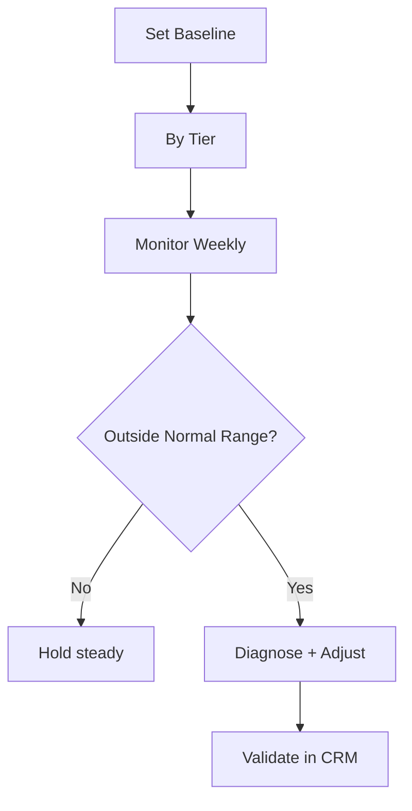

## Lesson

### Written Explanation
Benchmarks prevent guesswork. Without targets, you don’t know if a CPA is good, if conversion rate is slipping, or if a campaign is underperforming. Benchmarks create a baseline so you can act confidently.

In family law, benchmarks should be tier-aware. Brand usually has lower CPA and higher conversion rate. Competitor often has higher CPA and lower conversion rate. Core should be the engine with the most stable qualified results. Expansion is experimental and should be judged carefully with CRM outcomes.

Benchmarks are not universal. They change by market, firm, and offer. Start with a baseline from recent history (last 30–90 days), then refine as data stabilizes. When you see metrics outside the normal range, you investigate and diagnose before making big changes.

The most important benchmark is not a platform metric—it’s business outcomes: consult rate, signed-case rate, and case quality from CRM.

### Visual (Mermaid)

Audio/Video
type: video
filename: "module-16-benchmarking-and-performance-targets.mp4"
script: |
  Benchmarks define what “normal” looks like so you can spot problems fast.
  Set baselines by tier, monitor weekly, and investigate when metrics move outside the normal range.
  Always validate impact with CRM outcomes like consult rate and signed-case rate.

Practice Exercises

MCQ
id: p1
prompt: "Benchmarks are most useful because they:"
options:
  - id: a
    label: "Remove guesswork and define what 'good' looks like"
  - id: b
    label: "Guarantee performance improvements"
correct: [a]

MCQ
id: p2
prompt: "Which tier usually has the highest conversion rate and lowest CPA?"
options:
  - id: a
    label: "Brand"
  - id: b
    label: "Expansion"
correct: [a]

Short Text
id: p3
prompt: "The most important benchmarks are business outcomes in the ______."
acceptable_keywords: ["crm"]

Drag & Drop
id: p4
prompt: "Match the tier to the typical expectation."
buckets:
  - id: b1
    label: "Typically Lower CPA / Higher CVR"
  - id: b2
    label: "Typically Higher CPA / Lower CVR"
items:
  - id: i1
    label: "Brand"
  - id: i2
    label: "Competitor"
correct_buckets:
  i1: b1
  i2: b2

Module Test

MCQ
id: t1
prompt: "A benchmark is best defined as:"
options:
  - id: a
    label: "A baseline range used to detect abnormal performance"
  - id: b
    label: "A promise of future results"
correct: [a]

MCQ
id: t2
prompt: "Why should benchmarks be tier-aware?"
options:
  - id: a
    label: "Different tiers behave differently and have different expectations"
  - id: b
    label: "Google requires it"
correct: [a]

Short Text
id: t3
prompt: "Name one CRM outcome benchmark besides signed cases."
acceptable_keywords: ["consult","consults","consult rate","case quality","quality"]

Drag & Drop
id: t4
prompt: "Sort the items into Platform vs Business Outcome."
buckets:
  - id: b1
    label: "Platform Metric"
  - id: b2
    label: "Business Outcome"
items:
  - id: i1
    label: "CPA"
  - id: i2
    label: "Conversion Rate"
  - id: i3
    label: "Signed-Case Rate"
  - id: i4
    label: "Consult Rate"
correct_buckets:
  i1: b1
  i2: b1
  i3: b2
  i4: b2

MCQ
id: t5
prompt: "If metrics move outside the normal benchmark range, you should:"
options:
  - id: a
    label: "Diagnose the cause before making big changes"
  - id: b
    label: "Change everything at once"
correct: [a]

MCQ
id: t6
prompt: "The best starting point for benchmarks is usually:"
options:
  - id: a
    label: "Recent historical performance (last 30–90 days)"
  - id: b
    label: "A competitor blog post"
correct: [a]
