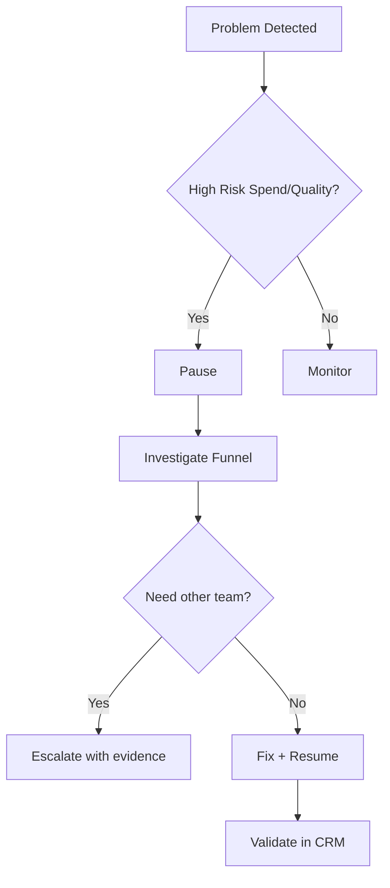

## Lesson

### Written Explanation
Not every issue is solved by “optimizing.” Some issues require a pause to stop waste while you investigate. This is especially true for tracking breaks, sudden quality drops, or obvious irrelevant traffic spending heavily.

Use a simple decision framework: **Pause → Investigate → Escalate.** Pause when the risk of continued spend is high. Investigate by checking the funnel in order: pacing, conversions, conversion rate, search terms, landing pages, and CRM outcomes. Escalate when the fix requires another team (dev, intake, analytics) or when the impact is large.

This framework protects budgets and prevents panic changes. It also creates clear communication: what you paused, why you paused it, what you checked, and what you need from others.

The goal is stability first, then improvement.

### Visual (Mermaid)

Audio/Video
type: video
filename: "module-17-pause-investigate-escalate.mp4"
script: |
  When risk is high, pause first to stop waste.
  Investigate in a consistent order: pacing, conversions, search terms, landing page, and CRM outcomes.
  Escalate when the fix requires another team and bring evidence, not guesses.

Practice Exercises

MCQ
id: p1
prompt: "You should pause a campaign when:"
options:
  - id: a
    label: "Spend is high and traffic is clearly irrelevant or tracking is broken"
  - id: b
    label: "CTR is slightly down for one day"
correct: [a]

MCQ
id: p2
prompt: "Escalation is appropriate when:"
options:
  - id: a
    label: "You want someone else to do the work with no evidence"
  - id: b
    label: "The fix requires another team (dev, intake, analytics) and impact is meaningful"
correct: [b]

Short Text
id: p3
prompt: "Complete the framework name: Pause, ________, Escalate."
acceptable_keywords: ["investigate"]

Drag & Drop
id: p4
prompt: "Match the step to its purpose."
buckets:
  - id: b1
    label: "Stop Waste"
  - id: b2
    label: "Find Root Cause"
items:
  - id: i1
    label: "Pause"
  - id: i2
    label: "Investigate"
correct_buckets:
  i1: b1
  i2: b2

Module Test

MCQ
id: t1
prompt: "What is the main reason to pause first in a high-risk situation?"
options:
  - id: a
    label: "To stop budget waste while you diagnose"
  - id: b
    label: "To increase impressions"
correct: [a]

MCQ
id: t2
prompt: "A safe investigation order should include:"
options:
  - id: a
    label: "Pacing, conversions, search terms, landing page, CRM outcomes"
  - id: b
    label: "Change bids, rewrite ads, then check tracking"
correct: [a]

Short Text
id: t3
prompt: "Name the system used to validate whether issues are affecting signed-case outcomes."
acceptable_keywords: ["crm"]

Drag & Drop
id: t4
prompt: "Sort the scenarios into Pause vs Monitor."
buckets:
  - id: b1
    label: "Pause"
  - id: b2
    label: "Monitor"
items:
  - id: i1
    label: "Tracking suddenly stops recording conversions"
  - id: i2
    label: "Slight CTR dip for one day"
  - id: i3
    label: "Irrelevant search terms consuming large spend"
  - id: i4
    label: "One ad group has lower impressions this week"
correct_buckets:
  i1: b1
  i3: b1
  i2: b2
  i4: b2

MCQ
id: t5
prompt: "Escalation should include:"
options:
  - id: a
    label: "Evidence, screenshots, dates, and specific impact"
  - id: b
    label: "A vague message that something feels off"
correct: [a]

MCQ
id: t6
prompt: "After fixes are made, you should:"
options:
  - id: a
    label: "Resume and validate outcomes in CRM"
  - id: b
    label: "Never touch the campaign again"
correct: [a]
